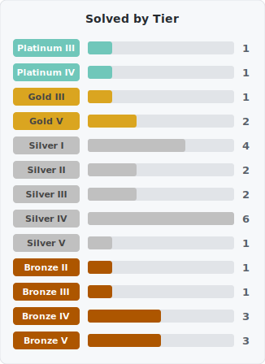

# Algorithm Solutions

Total: **16문제**

| 문제번호 | 문제 제목 | Tier | 문제 링크 |
|:---:|:---|:---:|:---:|
| 1406 | 에디터 |  Silver II | [BOJ](https://boj.kr/1406) |
| 5397 | 키로거 |  Silver II | [BOJ](https://boj.kr/5397) |
| 3273 | 두 수의 합 |  Silver III | [BOJ](https://boj.kr/3273) |
| 1158 | 요세푸스 문제 |  Silver IV | [BOJ](https://boj.kr/1158) |
| 10773 | 제로 |  Silver IV | [BOJ](https://boj.kr/10773) |
| 10828 | 스택 |  Silver IV | [BOJ](https://boj.kr/10828) |
| 10845 | 큐 |  Silver IV | [BOJ](https://boj.kr/10845) |
| 1475 | 방 번호 |  Silver V | [BOJ](https://boj.kr/1475) |
| 2577 | 숫자의 개수 |  Bronze II | [BOJ](https://boj.kr/2577) |
| 2441 | 별 찍기 - 4 |  Bronze III | [BOJ](https://boj.kr/2441) |
| 2439 | 별 찍기 - 2 |  Bronze IV | [BOJ](https://boj.kr/2439) |
| 2440 | 별 찍기 - 3 |  Bronze IV | [BOJ](https://boj.kr/2440) |
| 10808 | 알파벳 개수 |  Bronze IV | [BOJ](https://boj.kr/10808) |
| 1000 | A+B |  Bronze V | [BOJ](https://boj.kr/1000) |
| 2438 | 별 찍기 - 1 |  Bronze V | [BOJ](https://boj.kr/2438) |
| 10871 | X보다 작은 수 |  Bronze V | [BOJ](https://boj.kr/10871) |
